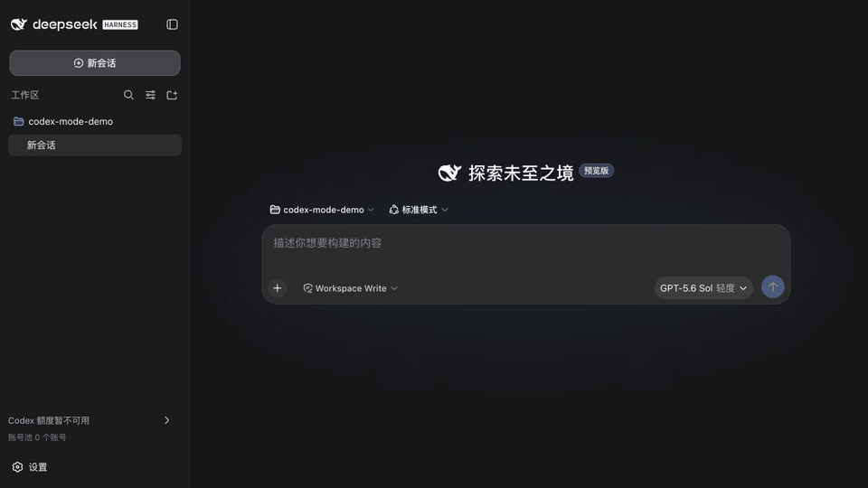

# DSH Codex Shared Pool

在 [DeepSeek Harness（DSH）](https://github.com/deepseek-ai/DeepSeek-Harness) 里自由使用 Codex 订阅额度：把多个 ChatGPT/Codex 订阅账号放进同一个本地账号池，并在请求前根据模型额度自动选择可用账号。

当前版本收口“一期”的本地多账号体验。

## 它解决什么问题

- 在 DSH 设置中分别完成 OAuth，添加多个 Codex 账号；不复制 `auth.json`。
- 每次请求前读取所选模型的上游额度；当前账号明确耗尽时，自动选择仍有额度的账号。
- 多个候选账号都可用时，优先选择上游重置时间更早的账号。
- 自动切换后，新账号会成为全局“使用中”账号；也可以点击“使用此账号”手动切换。
- 在设置页查看最近请求走了哪个账号、为什么切换、使用的模型以及成功/失败状态。
- 模型菜单沿用 Codex 客户端的中文模式名称和说明，包括“标准/快速”以及五档推理等级。
- 保留 Codex Responses、搜索、图片生成、`read_image`、TUI 管理等原有能力。

## 真实操作

以下三段展示一期最核心的产品操作：先看 Codex 模型的中文模式选择，再看真实账号池和各账号额度，最后看优先账号额度不足时如何自动切换并留下请求流水。第三段只模拟“首账号额度不足”的输入信号，账号选择、Provider 请求、响应和最近请求流水都由插件实际完成。

### Codex 模式选择

<p align="center">
  
</p>

> 画面来自把当前分支 tarball 安装进隔离的 stock DSH `0.1.0-rc.8` 后进行的真实操作；没有使用高保真动画模拟。

### 多账号池与额度概览

<p align="center">
  
</p>

### 额度不足时自动路由并留下最近请求流水

<p align="center">
  
</p>

> 第三段明确标注为混合演示：只把原使用中账号的额度信号临时投影为 `0%`，用于稳定触发回退；插件在请求发出前跳过它，并由下一可用账号完成真实 Provider 请求。流水中的“1 次请求”不代表 Token、费用或精确订阅消耗。

## 自动切换规则

一次本地请求按下面的顺序选择账号：

1. 读取账号优先顺序和当前会话绑定。
2. 检查各账号针对当前模型的可读额度。
3. “使用中”账号仍可用时继续使用。
4. 它明确为 `0%` 时，跳过该账号，从有可用额度的账号中选择重置时间更早者。
5. 选中的账号成为新的“使用中”账号，并尽量保持会话连续性。
6. 如果所有额度都无法读取，安全地退回现有绑定或首个账号，让 Provider 给出最终结果。

这里的切换发生在请求发往 Provider 之前，并不是先让已耗尽账号失败一次再重试。

## 最近请求

设置页只展示 metadata-only 的路由流水：

- 请求时的账号序号别名；
- 模型；
- 选择原因，例如优先账号、额度回退或并发绑定；
- 请求状态和时间。

它不会记录 prompt、response、文件、OAuth token 或会话正文。每条流水表示一次请求尝试，不代表 token、费用或精确订阅消耗。流水最多在 Host 进程内保留 100 条，Host 重启后清空。

## 安装

当前正式版发布在 npm 的 `latest` tag。安装到 DSH Web profile：

```bash
dsh plugin --profile web add dsh-codex-shared-pool@0.1.0
```

也可以省略版本以安装 `latest`；如需跟随后续预发布版本，请使用 `dsh-codex-shared-pool@next`。

然后启动同一个 Web profile，进入：

```text
设置 → OpenAI Codex
```

点击“添加账号”会发起一条独立 OAuth 授权链。授权等待期间可以手动取消；超时或 Host 重启后不会残留永久等待状态。

安装 patch 只挂载插件，不会把现有默认模型或搜索 Provider 改成
`openai-codex`。添加账号后，请在 DSH 中按需选择 OpenAI Codex Provider、模型，
并仅在希望搜索也走 Codex 时手动选择对应 Search Provider。

官方 SDK protocol 与 schema 包仍按社区目录规则声明为 peer；Host 构建会内联它们实际使用的轻量运行时代码，避免 stock DSH profile 还要重复安装官方包。

## TUI 管理

本地命令和设置页共用同一个 Host 账号池：

```text
/codex status
/codex login
/codex profiles
/codex add
/codex cancel
/codex activate <profile-id>
/codex rename <profile-id> <label>
/codex remove <profile-id>
/codex usage
/codex config
```

## 安全边界

- OAuth credential、refresh token、认证文件、Codex 子进程和文件系统访问只属于 Host。
- Browser 仅通过插件自己的 same-origin 路由读取经过类型约束的最小脱敏数据。
- 不提供凭据导出接口，也不要求上传或复制正在使用的 `auth.json`。
- 账号别名和最近请求记录不包含原始 profile id、prompt、response 或 token。
- 本项目通过公开 Cordis/DSH 扩展点安装，不修改或 fork DSH 核心。

## 第二期：Team 共享与自托管

第二期在同一个 npm 包中加入邀请制 Team、成员额度共享、Team 请求路由和自托管部署。OAuth 凭据、数据库连接和密钥仍只存在于 Host；Browser 只读取插件 same-origin 路由返回的最小脱敏投影。

在 **设置 → Codex 订阅池 → 团队** 使用邀请码：尚未连接时直接粘贴邀请码并查看邀请；已连接时点击 **加入其他团队**，核对团队名称后填写成员名称并加入。成功加入前，本机仍使用原团队；网络中断时可通过页面的恢复入口继续处理。

点击同页的 **切换团队** 可以选择本机保存的其他团队。切换只改变这台 DSH Host 当前使用的团队，保留其他团队的成员身份和共享账号；团队密钥保存在 Host 凭据存储，页面只显示团队和成员名称。当前仅支持同一配置服务器上的团队，其他设备需要单独加入；有待恢复的加入、授权或团队终止清理时，先完成对应流程再切换。


自托管模板在一台中央服务器上运行 four long-running processes：PostgreSQL、仅监听回环地址的 stock DSH Team Host、Credential Broker，以及窄接口的 Team API Edge；另有 one-shot database migrator 在应用负载启动前完成迁移并退出：

```sh
node deploy/self-hosted/init-secrets.mjs
docker compose -f deploy/self-hosted/compose.yml up --build -d
```

初始化器会在被忽略的 `deploy/self-hosted/.secrets/` 下创建 four mode-`0600` files：

- `postgres.env`：初始化数据库和不同运行身份的密码；
- `team-migrations.env`：只向一次性迁移器提供 schema-owner 数据库 URL；
- `team-host.env`：向 Team Host 提供控制面所需配置，但不提供凭据解密密钥；
- `credential-broker.env`：只向 Broker 提供 envelope master key、数据库 URL 和内部 API key。

需要让上游请求经过代理时，另行创建被 Git 忽略的
`deploy/self-hosted/.secrets/outbound-network.env`，并将权限设为 `0600`。这个文件不由初始化器生成；按需只填写标准的 `HTTP_PROXY`、`HTTPS_PROXY` 和 `NO_PROXY`，不要把代理地址或凭据写入 Compose、镜像或仓库。`NO_PROXY` 必须包含 `127.0.0.1` 和 `localhost`，以免回环上的 Host/Broker 请求绕远。

Compose 会把同一份可选代理文件交给 Team Host 和 Credential Broker。修改 `outbound-network.env` 后，必须重建或重启 Team Host 与 Credential Broker 才会生效：

```sh
docker compose -f deploy/self-hosted/compose.yml up -d --force-recreate team-host credential-broker
```

数据库按权限拆分为 `dsh_team_host_login` 和 `dsh_team_broker_login`。Team Host cannot read `team_contribution_credentials`；Credential Broker cannot read the Team control-plane tables。DSH Web/Remote API 不对公网暴露，Team API Edge 只转发 `/plugins/dsh-codex-shared-pool/team/...`。

完整验收与部署说明见 [第二期验收文档](docs/acceptance/team-mvp-phase-two.md)。

## 额度、订阅与升级排障

本地额度和订阅档位来自同一次 ChatGPT 用量请求。直连超时会让两项一起不可用，不代表账号额度为零，也不应据此要求重新登录。设置页的高级选项会显示代理是否启用。

- macOS：未设置代理环境变量时，插件启动时自动读取系统已启用的 HTTP/HTTPS 代理；重启 DSH 后仍会重新读取，无需把代理端口写进插件代码。自动发现的代理始终绕过 localhost、127.0.0.1 和 ::1，并带上系统代理例外列表。
- 手动设置的 `HTTP_PROXY` / `HTTPS_PROXY`（小写优先）优先于系统发现；显式设置为空会禁用系统发现。仅支持 HTTP/HTTPS 代理，不执行 PAC 脚本，也不把 SOCKS 地址当成 HTTP 代理。使用 PAC/SOCKS 时，请为 DSH 配置代理软件提供的 HTTP 监听地址。
- Linux、Windows、容器或后台服务：将代理环境变量持久化在启动服务的配置中，而不是只在当前终端临时 export。`NO_PROXY` 至少包含 `localhost,127.0.0.1,[::1]`。容器里的 127.0.0.1 指容器本身，应使用容器能访问到的代理地址。
- Team 模式的请求由远端 Credential Broker 发出，本机代理无法修复远端网络。Host 和 Broker 应使用匹配版本；只升级本地插件不会为旧 Broker 补上订阅字段。订阅未知时不猜测档位或金额。

Team 的额度来自 overview，金额和最近用量来自 usage；后者失败不再覆盖前者。数据库报缺列时，应由 Team 管理者备份数据库并执行迁移，普通团队成员不需要修改数据库。

自托管升级必须先构建匹配的 Host/Broker，再使用 schema-owner 运行迁移，成功后启动服务：

```sh
docker compose -f deploy/self-hosted/compose.yml build team-host credential-broker team-edge
docker compose -f deploy/self-hosted/compose.yml run --rm team-migrations
docker compose -f deploy/self-hosted/compose.yml up -d --force-recreate team-host credential-broker team-edge
```

非 Compose 部署使用同版本包的 `dsh-codex-team-migrate`，通过管理员的私密配置提供 `DSH_CODEX_SHARED_POOL_DATABASE_URL`，不要给运行中的 Host/Broker 增加 schema-owner 权限。迁移 22 会为缺失 `team_invites.label` 的旧库补回字段，并将缺失的邀请说明设为 `Team invitation`；保留已有说明、邀请码摘要和加密内容，不会重发或撤销邀请。它不会恢复已经丢失的原说明。初始化会检查用量表和邀请码表的实际字段，而不只信任迁移版本记录；若迁移记录齐全但字段仍缺失，说明数据库结构与迁移历史不一致，应停止升级、检查备份/恢复过程并修复结构，不要清空数据库或删除迁移记录来绕过检查。

## 开发与验证

```bash
pnpm test
pnpm run build
pnpm run verify:package
pnpm pack
```

`verify:package` 只验证 npm 包结构，不等于真实 DSH 安装验证。兼容性结论还需要把打包后的 tarball 安装进隔离的 stock DSH，再完成启动和路由探测。

本项目当前固定验证基线：

- DSH `0.1.0-rc.8`
- Cordis `4.0.1`
- Node.js `^22.19.0` 或 `>=24.0.0`

## 已知限制

- 上游额度取决于 Provider 当前可观测信号，插件不虚构精确 token 或订阅成本。
- 额度读取暂时失败时会 fail-open；只有明确读取到模型额度耗尽才会在请求前跳过账号。
- 本地最近请求流水是进程内观察数据，不是持久化账本。
- 更换 DSH/Cordis 版本前需要重新执行 stock 安装验证。

## 许可证

[MIT](LICENSE)
