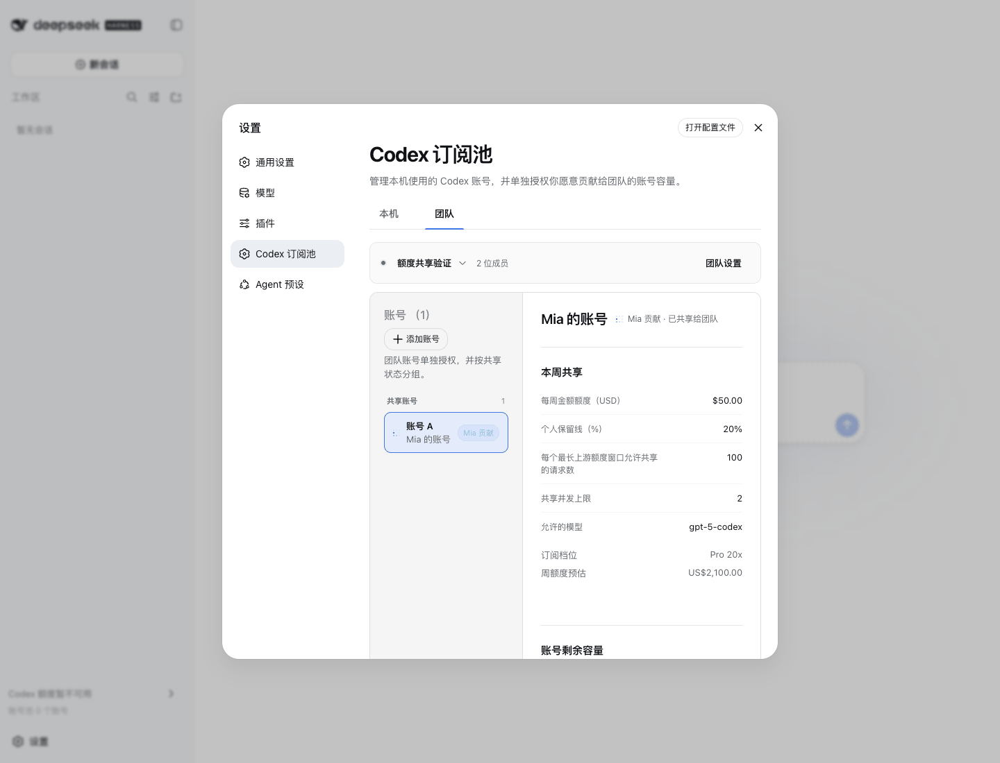

# Team shared-account quota visibility verification

Authenticated teammates can inspect active contributed accounts' safe quota and sharing summaries. The contributor alone retains sharing mutations and detailed request access.

## Compatibility

The local Host opts into details with `x-dsh-team-shared-details: 1`. The Team server keeps the original four-field directory for older clients. A new client connected to an older Team server renders missing quota as unavailable. Both the Team server and member installation need the new plugin for the new details.

## Evidence

- Failing service, parser and DOM tests reproduced the missing fields before implementation.
- `pnpm test`: 82 files passed, one PostgreSQL file skipped locally; 1,111 tests passed, 26 skipped; 33 prototype tests passed.
- Subsequently added strict sharing-parser checks: seven passed. The service suite including provider failure fallback: nine passed.
- `pnpm run build`, `pnpm run verify:package`, and `pnpm pack`: passed.
- Exact tarball installed into isolated stock DSH 0.1.0-rc.8, with its official entry checksum verified. Config composition, Web startup, Browser bundle and public profiles route probe passed.
- Initial probes used an incorrect route (404), then a same-origin-protected Team route without an Origin header (403). The final installation smoke used the public profiles route and passed.
- A real Chrome page rendered the installed package in stock DSH. Only Team management API responses were intercepted with synthetic member/account data. Assertions confirmed 74% remaining, $50 weekly cap, 20% reserve and the allowed model. Sharing mutation buttons were absent. The GIF records two actual page screenshots before/after scrolling.
- Sensitive scanner reports existing runtime variable references and deliberate test credential strings. Changed-line review found only synthetic private-field rejection fixtures; no real credentials were introduced. Package findings are existing deployment variables and runtime references. This is an adjudicated scan, not a zero-findings scanner result.
- Independent change-scoped review found no blocking issues. Its suggested provider failure test was added: limits remain visible, capacity reports `provider_unavailable`, and no percentage is fabricated.

## Limits

The Browser test proves rendering with synthetic data, not real OAuth/provider quota. The public Team server and shared instances were not deployed or restarted for this change. Real PostgreSQL and container smoke are delegated to repository CI.
